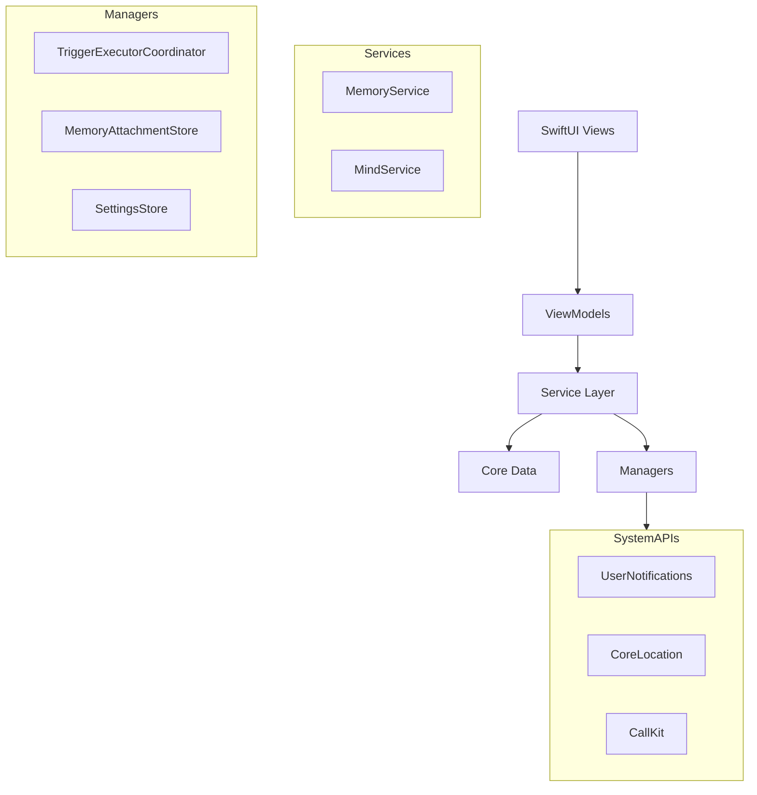
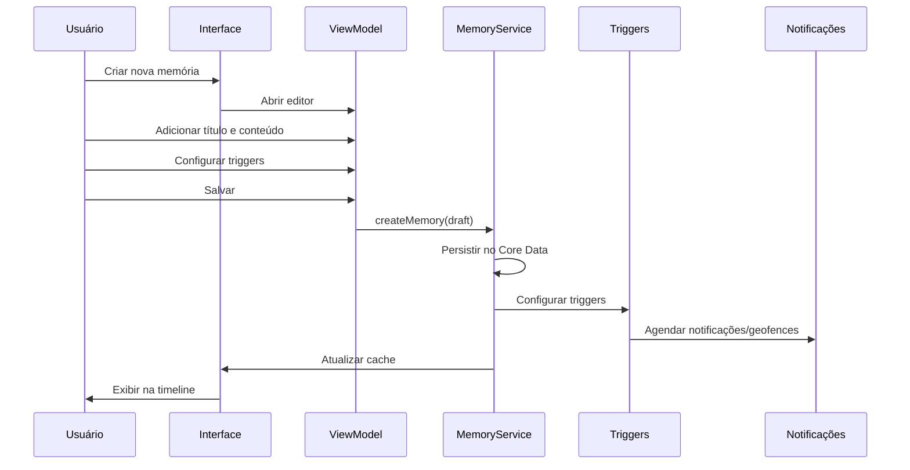
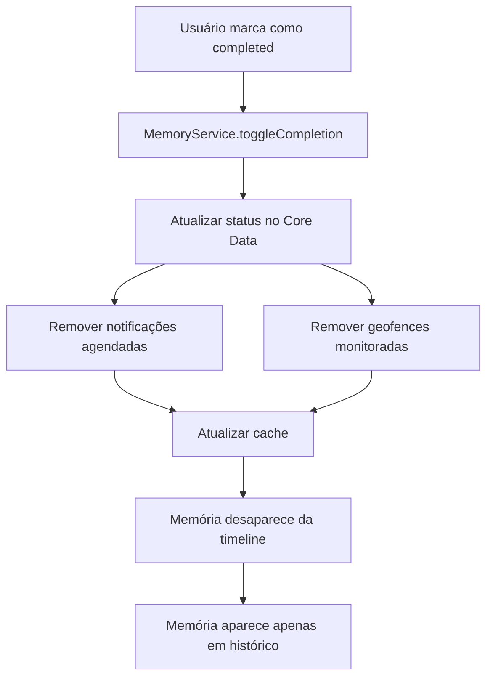
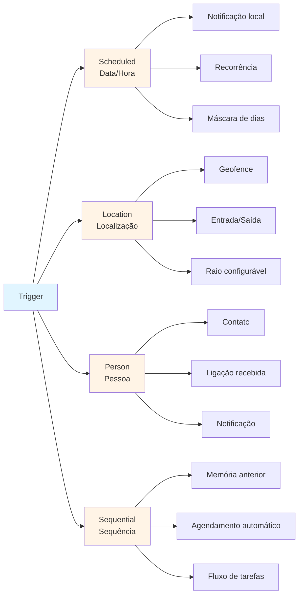
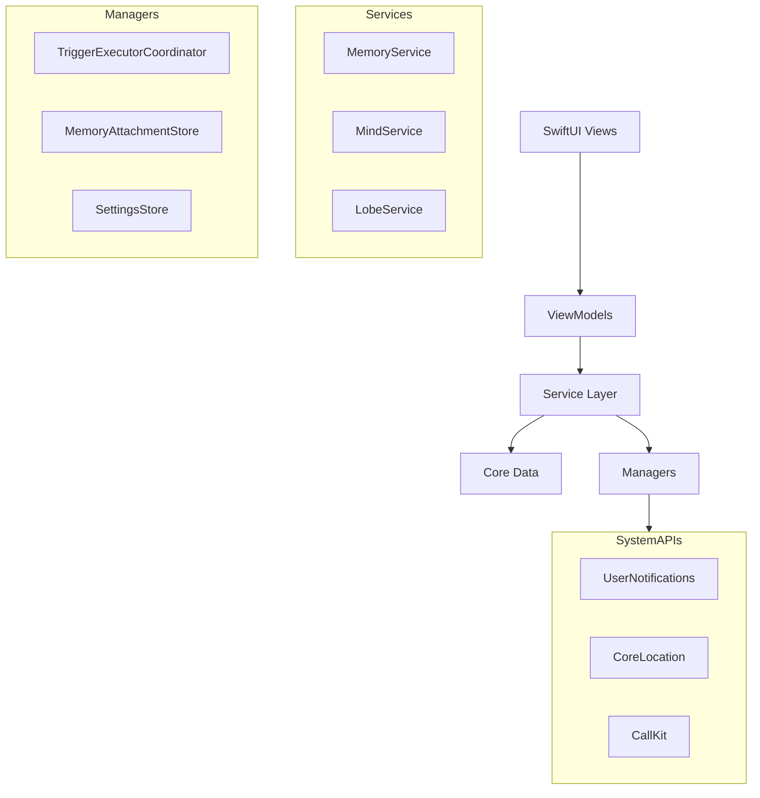
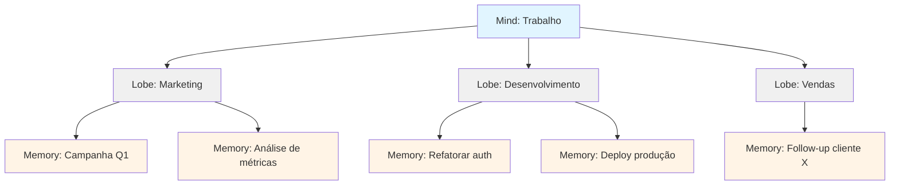

# Sparky

**Gerencie suas memórias, lembretes e tarefas com inteligência e automação.**

Sparky é um aplicativo iOS nativo desenvolvido em Swift/SwiftUI que oferece um sistema completo de gerenciamento de memórias (qualquer ideia, tarefa ou lembrete) com múltiplos tipos de conteúdo e gatilhos automatizados que disparam notificações, geofences e outras ações inteligentes.

---

## 📱 Visão Geral

Sparky foi projetado para pessoas que precisam de mais do que um simples aplicativo de tarefas. Ele combina a flexibilidade de um sistema de notas com o poder de automação através de **triggers** (gatilhos) inteligentes, permitindo que você configure lembretes que se adaptam ao seu contexto e rotina.

### Para que serve?

- **Gerenciar tarefas e lembretes** com múltiplos tipos de conteúdo (texto, checklist, fotos, links, áudio, arquivos)
- **Organizar ideias** em uma estrutura hierárquica intuitiva (Minds -> Minds -> Memories)
- **Automatizar lembretes** através de triggers inteligentes (data/hora, localização, pessoa, sequência)
- **Visualizar sua agenda** em uma timeline inteligente estilo calendário
- **Nunca esquecer** compromissos importantes com notificações e geofences automatizadas

### Público-alvo

Profissionais ocupados, estudantes, empreendedores e qualquer pessoa que precisa de um sistema confiável para capturar, organizar e lembrar informações importantes com o mínimo de esforço manual.

---

## ✨ Diferenciais

### 🧠 Organização Hierárquica Inteligente

Ao contrário de aplicativos que oferecem apenas listas planas ou tags simples, o Sparky utiliza uma estrutura hierárquica:

```
Minds (Contextos amplos)
  └── Minds (Subcategorias)
      └── Memories (Lembretes e tarefas)
```

**Exemplo prático:**
- **Mind**: "Trabalho"
  - **Mind**: "Marketing"
    - **Memory**: "Revisar campanha do Q1"
  - **Mind**: "Desenvolvimento"
    - **Memory**: "Refatorar módulo de autenticação"

Isso permite organização natural por contexto ou área de vida, facilitando a navegação e o gerenciamento de grandes quantidades de informações.

### ⚡ Triggers Automatizados Múltiplos

O Sparky suporta 4 tipos diferentes de triggers que podem ser combinados:

1. **Scheduled** (Data/Hora) - Lembretes por data/hora com recorrência e máscaras de dias da semana
2. **Location** (Localização) - Geofences que disparam quando você entra ou sai de um local
3. **Person** (Pessoa) - Gatilhos baseados em contatos, com suporte a detecção de ligações
4. **Sequential** (Sequência) - Relacionamentos entre memórias que agendam automaticamente o próximo item

**Vantagem:** Uma única memória pode ter múltiplos triggers, permitindo lembretes contextuais complexos (ex: "Lembre-me quando estiver perto do mercado E for quinta-feira").

### 📎 Conteúdo Rico e Modular

Cada memória suporta múltiplos blocos de conteúdo:

- **Texto rico** - Notas com markdown leve
- **Checklist** - Listas de tarefas marcáveis
- **Fotos** - Anexos de imagem
- **Links** - Coleções de URLs
- **Áudio** - Gravações ou uploads de áudio
- **Arquivos** - Documentos genéricos

A ordem dos blocos é significativa e pode ser reordenada, permitindo criar documentos ricos e estruturados.

### 📅 Timeline Inteligente

A timeline exibe memórias agrupadas por data em um formato de calendário vertical estilo agenda, facilitando a visualização de compromissos futuros. Suporta:

- Scroll infinito para navegação temporal
- Agrupamento automático por semanas e meses
- Filtros por tipo de conteúdo e trigger
- Visualização de recorrências

### 🎯 Comparação com Aplicativos Similares

| Funcionalidade | Sparky | Outros Apps |
|---|---|---|
| Organização hierárquica | ✅ Minds -> Minds | ❌ Listas planas ou tags |
| Múltiplos tipos de triggers | ✅ 4 tipos combináveis | ⚠️ Apenas data/hora |
| Conteúdo modular | ✅ Múltiplos blocos | ⚠️ Apenas texto ou checklist |
| Triggers de localização | ✅ Geofences nativas | ⚠️ Limitado ou ausente |
| Triggers de pessoa | ✅ Detecção de ligações | ❌ Não disponível |
| Triggers sequenciais | ✅ Automação de fluxos | ❌ Não disponível |
| Timeline inteligente | ✅ Calendário vertical | ⚠️ Lista simples |

---

## 🚀 Funcionalidades Principais

### Criar e Gerenciar Memórias

- Criação rápida via botão flutuante ou atalho de long-press
- Editor completo com suporte a múltiplos tipos de conteúdo
- Edição inline de checklists
- Anexos multimídia (fotos, áudio, arquivos)
- Organização visual com cores e ícones

### Organização em Minds

- **Minds**: Criar contextos amplos (ex: "Pessoal", "Trabalho", "Saúde") que podem conter outros Minds, criando uma hierarquia.
- **Limbo**: Memórias sem mind associado para organização posterior
- Navegação hierárquica intuitiva
- Contadores de memórias ativas e completadas

### Triggers (Gatilhos)

#### 1. Scheduled (Data/Hora)
- Lembretes pontuais ou recorrentes
- Recorrência: diária, semanal, mensal, anual
- Máscara de dias da semana para flexibilidade
- Data de início e término opcionais
- Notificações locais configuráveis

#### 2. Location (Localização)
- Geofences com raio configurável (máx. 1000m)
- Dispara em entrada ou saída do local
- Busca integrada de lugares
- Seleção manual no mapa
- Até 20 geofences simultâneas (limite iOS)

#### 3. Person (Pessoa)
- Associação com contatos da agenda
- Detecção automática de ligações recebidas
- Notificações quando há interação com a pessoa
- Suporte a nomes livres ou contatos cadastrados

#### 4. Sequential (Sequência)
- Relacionamento entre memórias
- Agendamento automático do próximo item ao completar o anterior
- Visualização de cadeias de tarefas
- Controle de progresso em fluxos complexos

### Tipos de Conteúdo Suportados

- **Rich Text**: Notas livres com markdown leve, múltiplos blocos por memória
- **Checklist**: Listas de tarefas marcáveis com auto-completar opcional
- **Photos**: Múltiplas imagens por memória, armazenamento otimizado
- **Links**: Coleções de URLs com preview automático
- **Audio**: Gravações ou uploads de arquivos de áudio
- **Files**: Documentos genéricos com identificação por tipo

### Timeline e Calendário

- Visualização em calendário vertical estilo agenda
- Agrupamento por data com seções de semana
- Scroll infinito para navegação temporal
- Filtros por tipo de conteúdo e trigger
- Indicadores visuais de recorrência
- Memórias fixadas destacadas no topo

### Busca e Filtros

- Busca textual em títulos e corpos de memórias
- Filtros por tipo de conteúdo (texto, checklist, fotos, etc.)
- Filtros por tipo de trigger (scheduled, location, person, sequential)
- Toggle de inbox (memórias sem trigger nem mind)
- Busca em tempo real com resultados instantâneos

### Outras Funcionalidades

- **Multi-seleção**: Ações em lote (completar, mover, deletar)
- **Status tracking**: Ciclo de vida active → completed
- **Prioridades**: Sistema de prioridades visual
- **Due dates**: Datas de vencimento independentes de triggers
- **Pin/Unpin**: Fixar memórias importantes no topo
- **Onboarding**: Fluxo de introdução para novos usuários

---

## 🏗️ Arquitetura Técnica

### Stack Tecnológico

- **Linguagem**: Swift 5.9+
- **UI Framework**: SwiftUI
- **Persistência**: Core Data (com CloudKit habilitado)
- **Reactive Programming**: Combine
- **Notificações**: UserNotifications
- **Localização**: CoreLocation (geofences)
- **Mapas**: MapKit
- **Contatos**: Contacts framework

### Padrões Arquiteturais

O Sparky segue uma arquitetura **MVVM (Model-View-ViewModel)** com camadas de serviços:



### Estrutura de Pastas

```
sparky/
├── AppEnvironment.swift          # Singleton central, coordenação
├── sparkyApp.swift          # Entry point
├── ContentView.swift             # Root view com tabs
├── Persistence.swift             # Core Data stack
│
├── Model/                        # Modelos de domínio
│   ├── Memory/
│   ├── Mind/
│   ├── Triggers/
│   └── Recurrence/
│
├── Services/                     # Lógica de negócio
│   ├── MemoryService.swift
│   ├── MindService.swift
│   └── MemoryBulkActionProcessor.swift
│
├── Executors/                    # Executores de triggers
│   ├── TriggerExecutorCoordinator.swift
│   ├── ScheduledTriggerExecutor.swift
│   ├── LocationTriggerExecutor.swift
│   ├── PersonTriggerExecutor.swift
│   └── SequentialTriggerExecutor.swift
│
├── Managers/                     # Gerenciadores especializados
│   ├── MemoryAttachmentStore.swift
│   └── AppIconManager.swift
│
├── ViewModels/                   # ViewModels
│   └── MemoryEditorViewModel.swift
│
├── Views/                        # Interface do usuário
│   ├── Memories/
│   │   ├── MemoryTimelineView.swift
│   │   ├── MemoryCardView.swift
│   │   ├── Editor/
│   │   └── Calendar/
│   ├── Minds/
│   │   ├── MindRootView.swift
│   │   └── MindDetailView.swift
│   ├── Onboarding/
│   └── Settings/
│
├── Settings/                     # Configurações
│   └── SettingsStore.swift
│
└── Utilities/                    # Utilitários
    ├── Color+Hex.swift
    ├── SpeechTranscriber.swift
    └── String+Optional.swift
```

### Conceitos Principais

#### Memory (Memória)

A unidade central do sistema. Representa qualquer lembrança, ideia ou tarefa que o usuário deseja preservar.

**Propriedades principais:**
- Título e corpo (texto agregado)
- Status (active, completed)
- Prioridade (low, medium, high, none)
- Mind associado (opcional)
- Triggers (múltiplos)
- Conteúdos (múltiplos blocos)
- Anexos (fotos, links, áudio, arquivos)
- Due date (independente de triggers)

#### Mind (Mente/Contexto)

Contexto amplo para organização. Pode ser uma área de vida, projeto grande ou categoria principal. Um Mind pode conter outros Minds, criando uma hierarquia.

**Exemplos**: "Trabalho", "Pessoal", "Saúde", "Estudos"

#### Trigger (Gatilho)

Gatilho automatizado que dispara ações quando condições são atendidas.

**Tipos:**
- `scheduled`: Dispara em data/hora específica
- `location`: Dispara ao entrar/sair de local
- `person`: Dispara ao interagir com pessoa
- `sequential`: Dispara ao completar memória anterior

---

## 🔄 Fluxos Principais

### Fluxo de Uso Básico



### Criação de Memória

1. **Usuário** toca botão "+" na tab bar (tap rápido) ou long-press (abre editor diretamente)
2. **Sistema** abre `QuickMemorySheet` (criação rápida) ou `MemoryEditorView` (editor completo)
3. **Usuário** adiciona:
   - Título
   - Conteúdo (texto, checklist, fotos, etc.)
   - Mind (opcional)
   - Triggers (opcional)
4. **Sistema** valida e persiste via `MemoryService`
5. **Sistema** configura triggers (notificações, geofences)
6. **Sistema** atualiza timeline e exibe memória

### Completar Memória



### Adicionar Trigger de Localização

1. **Usuário** abre editor de memória
2. **Usuário** toca "Add Trigger" → "Location"
3. **Sistema** abre `LocationPickerView` com mapa
4. **Usuário** busca lugar ou seleciona no mapa
5. **Usuário** configura:
   - Nome do local
   - Raio (padrão: 200m, máx: 1000m)
   - Evento (entrada ou saída)
6. **Sistema** cria trigger e salva memória
7. **Sistema** adiciona geofence ao `LocationTriggerExecutor`
8. **Sistema** monitora região no background

### Estrutura Hierárquica


### Tipos de Triggers



---

## 📦 Instalação e Desenvolvimento

### Requisitos

- **Xcode**: 15.0 ou superior
- **iOS Deployment Target**: iOS 17.0+
- **Swift**: 5.9+
- **macOS**: Para desenvolvimento (Xcode requer macOS)

### Como Rodar

1. **Clone o repositório**
   ```bash
   git clone <repository-url>
   cd sparky
   ```

2. **Abra o projeto**
   ```bash
   open sparky.xcodeproj
   ```

3. **Selecione o scheme** "sparky" no Xcode

4. **Escolha um simulador** ou dispositivo físico iOS 17.0+

5. **Execute** (⌘R) ou clique no botão Play

### Estrutura do Projeto

O projeto segue uma estrutura modularizada onde cada componente possui seu próprio arquivo:

- **Services**: Lógica de negócio e CRUD
- **Executors**: Execução de triggers automatizados
- **Managers**: Gerenciadores especializados (anexos, configurações)
- **ViewModels**: Estado da UI e lógica de apresentação
- **Views**: Componentes SwiftUI reutilizáveis
- **Model**: Modelos de domínio imutáveis

### Convenções de Código

- **Separação de arquivos**: Cada componente em arquivo próprio
- **Inglês obrigatório**: Variáveis, métodos e propriedades em inglês
- **Português**: Documentação e comunicação com usuário
- **Sem código legado**: Remover código antigo ao refatorar
- **Modularização**: Código limpo e organizado

---

## 📚 Documentação

### Documentação Completa

A pasta `docs/` contém documentação detalhada sobre aspectos específicos do projeto:

- **[project-description.md](docs/project-description.md)**: Descrição completa do projeto, arquitetura e componentes
- **[memory-business-rules.md](docs/memory-business-rules.md)**: Regras de negócio sobre memórias e minds
- **[memory-status-flow.md](docs/memory-status-flow.md)**: Fluxo detalhado de mudança de status (active ↔ completed)
- **[memory-triggers.md](docs/memory-triggers.md)**: Documentação técnica sobre triggers
- **[trigger-capabilities.md](docs/trigger-capabilities.md)**: Catálogo de triggers suportados e futuros
- **[timeline-refactoring.md](docs/timeline-refactoring.md)**: Detalhes da implementação da timeline
- **[calendar-infinite-scroll.md](docs/calendar-infinite-scroll.md)**: Implementação de scroll infinito no calendário
- **[filter-badges-bar-scroll-fix.md](docs/filter-badges-bar-scroll-fix.md)**: Correção de scroll em badges de filtro

### Pontos de Entrada Importantes

- **Entry point**: `sparkyApp.swift` → `ContentView`
- **Inicialização**: `AppEnvironment.bootstrap()` carrega dados e solicita permissões
- **Criação de memória**: `ContentView` → `MemoryEditorRoute` → `MemoryEditorView`
- **Timeline**: `MemoryTimelineView` → `MemoryService.timelineMemories()`
- **Organização**: `MindRootView` → `MindDetailView`

---

## 🎯 Roadmap e Funcionalidades Futuras

### Implementado ✅

- CRUD completo de memórias
- Múltiplos tipos de conteúdo
- Triggers: scheduled, location, person, sequential
- Organização hierárquica (Minds -> Minds)
- Timeline com calendário vertical
- Scroll infinito
- Busca e filtros
- Multi-seleção e ações em lote
- Notificações locais
- Geofences funcionais
- Onboarding

### Planejado 🔜

- Tags integradas ao modelo de memórias
- Agenda visual (modo calendário completo)
- Sincronização iCloud ativa (CloudKit já habilitado)
- Triggers adicionais (Focus, Carro, Bateria, etc.)
- Melhorias em detecção de contatos
- Extensões para Shortcuts do iOS

---

## 🤝 Contribuição

Este é um projeto pessoal em desenvolvimento ativo. Contribuições, sugestões e feedback são bem-vindos!

### Como Contribuir

1. Fork o projeto
2. Crie uma branch para sua feature (`git checkout -b feature/AmazingFeature`)
3. Commit suas mudanças (`git commit -m 'Add some AmazingFeature'`)
4. Push para a branch (`git push origin feature/AmazingFeature`)
5. Abra um Pull Request

### Padrões de Contribuição

- Seguir convenções de código existentes
- Manter código modularizado (um componente por arquivo)
- Usar inglês para código e português para documentação
- Adicionar documentação quando necessário
- Testar funcionalidades antes de commitar

---

## 📄 Licença

Este projeto é privado e de propriedade do autor. Todos os direitos reservados.

---

## 👤 Autor

**Erick Patrick Barcelos**

Desenvolvido com ❤️ usando Swift e SwiftUI.

---

## 🙏 Agradecimentos

- Comunidade Swift/SwiftUI pela excelente documentação
- Desenvolvedores de bibliotecas open-source que inspiraram soluções
- Testadores beta que forneceram feedback valioso

---

**Última atualização**: Janeiro 2025


---

## 📱 Visão Geral

Sparky foi projetado para pessoas que precisam de mais do que um simples aplicativo de tarefas. Ele combina a flexibilidade de um sistema de notas com o poder de automação através de **triggers** (gatilhos) inteligentes, permitindo que você configure lembretes que se adaptam ao seu contexto e rotina.

### Para que serve?

- **Gerenciar tarefas e lembretes** com múltiplos tipos de conteúdo (texto, checklist, fotos, links, áudio, arquivos)
- **Organizar ideias** em uma estrutura hierárquica intuitiva (Minds → Lobes → Memories)
- **Automatizar lembretes** através de triggers inteligentes (data/hora, localização, pessoa, sequência)
- **Visualizar sua agenda** em uma timeline inteligente estilo calendário
- **Nunca esquecer** compromissos importantes com notificações e geofences automatizadas

### Público-alvo

Profissionais ocupados, estudantes, empreendedores e qualquer pessoa que precisa de um sistema confiável para capturar, organizar e lembrar informações importantes com o mínimo de esforço manual.

---

## ✨ Diferenciais

### 🧠 Organização Hierárquica Inteligente

Ao contrário de aplicativos que oferecem apenas listas planas ou tags simples, o Sparky utiliza uma estrutura hierárquica:

```
Minds (Contextos amplos)
  └── Lobes (Subcategorias)
      └── Memories (Lembretes e tarefas)
```

**Exemplo prático:**
- **Mind**: "Trabalho"
  - **Lobe**: "Marketing"
    - **Memory**: "Revisar campanha do Q1"
  - **Lobe**: "Desenvolvimento"
    - **Memory**: "Refatorar módulo de autenticação"

Isso permite organização natural por contexto ou área de vida, facilitando a navegação e o gerenciamento de grandes quantidades de informações.

### ⚡ Triggers Automatizados Múltiplos

O Sparky suporta 4 tipos diferentes de triggers que podem ser combinados:

1. **Scheduled** (Data/Hora) - Lembretes por data/hora com recorrência e máscaras de dias da semana
2. **Location** (Localização) - Geofences que disparam quando você entra ou sai de um local
3. **Person** (Pessoa) - Gatilhos baseados em contatos, com suporte a detecção de ligações
4. **Sequential** (Sequência) - Relacionamentos entre memórias que agendam automaticamente o próximo item

**Vantagem:** Uma única memória pode ter múltiplos triggers, permitindo lembretes contextuais complexos (ex: "Lembre-me quando estiver perto do mercado E for quinta-feira").

### 📎 Conteúdo Rico e Modular

Cada memória suporta múltiplos blocos de conteúdo:

- **Texto rico** - Notas com markdown leve
- **Checklist** - Listas de tarefas marcáveis
- **Fotos** - Anexos de imagem
- **Links** - Coleções de URLs
- **Áudio** - Gravações ou uploads de áudio
- **Arquivos** - Documentos genéricos

A ordem dos blocos é significativa e pode ser reordenada, permitindo criar documentos ricos e estruturados.

### 📅 Timeline Inteligente

A timeline exibe memórias agrupadas por data em um formato de calendário vertical estilo agenda, facilitando a visualização de compromissos futuros. Suporta:

- Scroll infinito para navegação temporal
- Agrupamento automático por semanas e meses
- Filtros por tipo de conteúdo e trigger
- Visualização de recorrências

### 🎯 Comparação com Aplicativos Similares

| Funcionalidade | Sparky | Outros Apps |
|---|---|---|
| Organização hierárquica | ✅ Minds → Lobes | ❌ Listas planas ou tags |
| Múltiplos tipos de triggers | ✅ 4 tipos combináveis | ⚠️ Apenas data/hora |
| Conteúdo modular | ✅ Múltiplos blocos | ⚠️ Apenas texto ou checklist |
| Triggers de localização | ✅ Geofences nativas | ⚠️ Limitado ou ausente |
| Triggers de pessoa | ✅ Detecção de ligações | ❌ Não disponível |
| Triggers sequenciais | ✅ Automação de fluxos | ❌ Não disponível |
| Timeline inteligente | ✅ Calendário vertical | ⚠️ Lista simples |

---

## 🚀 Funcionalidades Principais

### Criar e Gerenciar Memórias

- Criação rápida via botão flutuante ou atalho de long-press
- Editor completo com suporte a múltiplos tipos de conteúdo
- Edição inline de checklists
- Anexos multimídia (fotos, áudio, arquivos)
- Organização visual com cores e ícones

### Organização em Minds e Lobes

- **Minds**: Criar contextos amplos (ex: "Pessoal", "Trabalho", "Saúde")
- **Lobes**: Subcategorias dentro de cada Mind (ex: "Marketing", "Desenvolvimento")
- **Limbo**: Memórias sem lobe associado para organização posterior
- Navegação hierárquica intuitiva
- Contadores de memórias ativas e completadas

### Triggers (Gatilhos)

#### 1. Scheduled (Data/Hora)
- Lembretes pontuais ou recorrentes
- Recorrência: diária, semanal, mensal, anual
- Máscara de dias da semana para flexibilidade
- Data de início e término opcionais
- Notificações locais configuráveis

#### 2. Location (Localização)
- Geofences com raio configurável (máx. 1000m)
- Dispara em entrada ou saída do local
- Busca integrada de lugares
- Seleção manual no mapa
- Até 20 geofences simultâneas (limite iOS)

#### 3. Person (Pessoa)
- Associação com contatos da agenda
- Detecção automática de ligações recebidas
- Notificações quando há interação com a pessoa
- Suporte a nomes livres ou contatos cadastrados

#### 4. Sequential (Sequência)
- Relacionamento entre memórias
- Agendamento automático do próximo item ao completar o anterior
- Visualização de cadeias de tarefas
- Controle de progresso em fluxos complexos

### Tipos de Conteúdo Suportados

- **Rich Text**: Notas livres com markdown leve, múltiplos blocos por memória
- **Checklist**: Listas de tarefas marcáveis com auto-completar opcional
- **Photos**: Múltiplas imagens por memória, armazenamento otimizado
- **Links**: Coleções de URLs com preview automático
- **Audio**: Gravações ou uploads de arquivos de áudio
- **Files**: Documentos genéricos com identificação por tipo

### Timeline e Calendário

- Visualização em calendário vertical estilo agenda
- Agrupamento por data com seções de semana
- Scroll infinito para navegação temporal
- Filtros por tipo de conteúdo e trigger
- Indicadores visuais de recorrência
- Memórias fixadas destacadas no topo

### Busca e Filtros

- Busca textual em títulos e corpos de memórias
- Filtros por tipo de conteúdo (texto, checklist, fotos, etc.)
- Filtros por tipo de trigger (scheduled, location, person, sequential)
- Toggle de inbox (memórias sem trigger nem lobe)
- Busca em tempo real com resultados instantâneos

### Outras Funcionalidades

- **Multi-seleção**: Ações em lote (completar, mover, deletar)
- **Status tracking**: Ciclo de vida active → completed
- **Prioridades**: Sistema de prioridades visual
- **Due dates**: Datas de vencimento independentes de triggers
- **Pin/Unpin**: Fixar memórias importantes no topo
- **Onboarding**: Fluxo de introdução para novos usuários

---

## 🏗️ Arquitetura Técnica

### Stack Tecnológico

- **Linguagem**: Swift 5.9+
- **UI Framework**: SwiftUI
- **Persistência**: Core Data (com CloudKit habilitado)
- **Reactive Programming**: Combine
- **Notificações**: UserNotifications
- **Localização**: CoreLocation (geofences)
- **Mapas**: MapKit
- **Contatos**: Contacts framework

### Padrões Arquiteturais

O Sparky segue uma arquitetura **MVVM (Model-View-ViewModel)** com camadas de serviços:



### Estrutura de Pastas

```
sparky/
├── AppEnvironment.swift          # Singleton central, coordenação
├── sparkyApp.swift          # Entry point
├── ContentView.swift             # Root view com tabs
├── Persistence.swift             # Core Data stack
│
├── Model/                        # Modelos de domínio
│   ├── Memory/
│   ├── Mind/
│   ├── Space/ (Lobe)
│   ├── Triggers/
│   └── Recurrence/
│
├── Services/                     # Lógica de negócio
│   ├── MemoryService.swift
│   ├── MindService.swift
│   ├── LobeService.swift
│   └── MemoryBulkActionProcessor.swift
│
├── Executors/                    # Executores de triggers
│   ├── TriggerExecutorCoordinator.swift
│   ├── ScheduledTriggerExecutor.swift
│   ├── LocationTriggerExecutor.swift
│   ├── PersonTriggerExecutor.swift
│   └── SequentialTriggerExecutor.swift
│
├── Managers/                     # Gerenciadores especializados
│   ├── MemoryAttachmentStore.swift
│   └── AppIconManager.swift
│
├── ViewModels/                   # ViewModels
│   └── MemoryEditorViewModel.swift
│
├── Views/                        # Interface do usuário
│   ├── Memories/
│   │   ├── MemoryTimelineView.swift
│   │   ├── MemoryCardView.swift
│   │   ├── Editor/
│   │   └── Calendar/
│   ├── Minds/
│   │   ├── MindRootView.swift
│   │   └── MindDetailView.swift
│   ├── Onboarding/
│   └── Settings/
│
├── Settings/                     # Configurações
│   └── SettingsStore.swift
│
└── Utilities/                    # Utilitários
    ├── Color+Hex.swift
    ├── SpeechTranscriber.swift
    └── String+Optional.swift
```

### Conceitos Principais

#### Memory (Memória)

A unidade central do sistema. Representa qualquer lembrança, ideia ou tarefa que o usuário deseja preservar.

**Propriedades principais:**
- Título e corpo (texto agregado)
- Status (active, completed)
- Prioridade (low, medium, high, none)
- Lobe associado (opcional)
- Triggers (múltiplos)
- Conteúdos (múltiplos blocos)
- Anexos (fotos, links, áudio, arquivos)
- Due date (independente de triggers)

#### Mind (Mente/Contexto)

Contexto amplo para organização. Pode ser uma área de vida, projeto grande ou categoria principal.

**Exemplos**: "Trabalho", "Pessoal", "Saúde", "Estudos"

#### Lobe (Lobo/Subcategoria)

Subcategoria dentro de um Mind. Permite organização granular dentro de contextos maiores.

**Exemplos**: 
- Dentro de "Trabalho": "Marketing", "Desenvolvimento", "Vendas"
- Dentro de "Pessoal": "Família", "Amigos", "Hobbies"

#### Trigger (Gatilho)

Gatilho automatizado que dispara ações quando condições são atendidas.

**Tipos:**
- `scheduled`: Dispara em data/hora específica
- `location`: Dispara ao entrar/sair de local
- `person`: Dispara ao interagir com pessoa
- `sequential`: Dispara ao completar memória anterior

---

## 🔄 Fluxos Principais

### Fluxo de Uso Básico


### Criação de Memória

1. **Usuário** toca botão "+" na tab bar (tap rápido) ou long-press (abre editor diretamente)
2. **Sistema** abre `QuickMemorySheet` (criação rápida) ou `MemoryEditorView` (editor completo)
3. **Usuário** adiciona:
   - Título
   - Conteúdo (texto, checklist, fotos, etc.)
   - Lobe (opcional)
   - Triggers (opcional)
4. **Sistema** valida e persiste via `MemoryService`
5. **Sistema** configura triggers (notificações, geofences)
6. **Sistema** atualiza timeline e exibe memória

### Completar Memória


### Adicionar Trigger de Localização

1. **Usuário** abre editor de memória
2. **Usuário** toca "Add Trigger" → "Location"
3. **Sistema** abre `LocationPickerView` com mapa
4. **Usuário** busca lugar ou seleciona no mapa
5. **Usuário** configura:
   - Nome do local
   - Raio (padrão: 200m, máx: 1000m)
   - Evento (entrada ou saída)
6. **Sistema** cria trigger e salva memória
7. **Sistema** adiciona geofence ao `LocationTriggerExecutor`
8. **Sistema** monitora região no background

### Estrutura Hierárquica



### Tipos de Triggers


---

## 📦 Instalação e Desenvolvimento

### Requisitos

- **Xcode**: 15.0 ou superior
- **iOS Deployment Target**: iOS 17.0+
- **Swift**: 5.9+
- **macOS**: Para desenvolvimento (Xcode requer macOS)

### Como Rodar

1. **Clone o repositório**
   ```bash
   git clone <repository-url>
   cd sparky
   ```

2. **Abra o projeto**
   ```bash
   open sparky.xcodeproj
   ```

3. **Selecione o scheme** "sparky" no Xcode

4. **Escolha um simulador** ou dispositivo físico iOS 17.0+

5. **Execute** (⌘R) ou clique no botão Play

### Estrutura do Projeto

O projeto segue uma estrutura modularizada onde cada componente possui seu próprio arquivo:

- **Services**: Lógica de negócio e CRUD
- **Executors**: Execução de triggers automatizados
- **Managers**: Gerenciadores especializados (anexos, configurações)
- **ViewModels**: Estado da UI e lógica de apresentação
- **Views**: Componentes SwiftUI reutilizáveis
- **Model**: Modelos de domínio imutáveis

### Convenções de Código

- **Separação de arquivos**: Cada componente em arquivo próprio
- **Inglês obrigatório**: Variáveis, métodos e propriedades em inglês
- **Português**: Documentação e comunicação com usuário
- **Sem código legado**: Remover código antigo ao refatorar
- **Modularização**: Código limpo e organizado

---

## 📚 Documentação

### Documentação Completa

A pasta `docs/` contém documentação detalhada sobre aspectos específicos do projeto:

- **[project-description.md](docs/project-description.md)**: Descrição completa do projeto, arquitetura e componentes
- **[memory-business-rules.md](docs/memory-business-rules.md)**: Regras de negócio sobre memórias, minds, lobes e triggers
- **[memory-status-flow.md](docs/memory-status-flow.md)**: Fluxo detalhado de mudança de status (active ↔ completed)
- **[memory-triggers.md](docs/memory-triggers.md)**: Documentação técnica sobre triggers
- **[trigger-capabilities.md](docs/trigger-capabilities.md)**: Catálogo de triggers suportados e futuros
- **[timeline-refactoring.md](docs/timeline-refactoring.md)**: Detalhes da implementação da timeline
- **[calendar-infinite-scroll.md](docs/calendar-infinite-scroll.md)**: Implementação de scroll infinito no calendário
- **[filter-badges-bar-scroll-fix.md](docs/filter-badges-bar-scroll-fix.md)**: Correção de scroll em badges de filtro

### Pontos de Entrada Importantes

- **Entry point**: `sparkyApp.swift` → `ContentView`
- **Inicialização**: `AppEnvironment.bootstrap()` carrega dados e solicita permissões
- **Criação de memória**: `ContentView` → `MemoryEditorRoute` → `MemoryEditorView`
- **Timeline**: `MemoryTimelineView` → `MemoryService.timelineMemories()`
- **Organização**: `MindRootView` → `MindDetailView` → `LobeDetailView`

---

## 🎯 Roadmap e Funcionalidades Futuras

### Implementado ✅

- CRUD completo de memórias
- Múltiplos tipos de conteúdo
- Triggers: scheduled, location, person, sequential
- Organização hierárquica (Minds → Lobes)
- Timeline com calendário vertical
- Scroll infinito
- Busca e filtros
- Multi-seleção e ações em lote
- Notificações locais
- Geofences funcionais
- Onboarding

### Planejado 🔜

- Tags integradas ao modelo de memórias
- Agenda visual (modo calendário completo)
- Sincronização iCloud ativa (CloudKit já habilitado)
- Triggers adicionais (Focus, Carro, Bateria, etc.)
- Melhorias em detecção de contatos
- Extensões para Shortcuts do iOS

---

## 🤝 Contribuição

Este é um projeto pessoal em desenvolvimento ativo. Contribuições, sugestões e feedback são bem-vindos!

### Como Contribuir

1. Fork o projeto
2. Crie uma branch para sua feature (`git checkout -b feature/AmazingFeature`)
3. Commit suas mudanças (`git commit -m 'Add some AmazingFeature'`)
4. Push para a branch (`git push origin feature/AmazingFeature`)
5. Abra um Pull Request

### Padrões de Contribuição

- Seguir convenções de código existentes
- Manter código modularizado (um componente por arquivo)
- Usar inglês para código e português para documentação
- Adicionar documentação quando necessário
- Testar funcionalidades antes de commitar

---

## 📄 Licença

Este projeto é privado e de propriedade do autor. Todos os direitos reservados.

---

## 👤 Autor

**Erick Patrick Barcelos**

Desenvolvido com ❤️ usando Swift e SwiftUI.

---

## 🙏 Agradecimentos

- Comunidade Swift/SwiftUI pela excelente documentação
- Desenvolvedores de bibliotecas open-source que inspiraram soluções
- Testadores beta que forneceram feedback valioso

---

**Última atualização**: Janeiro 2025
