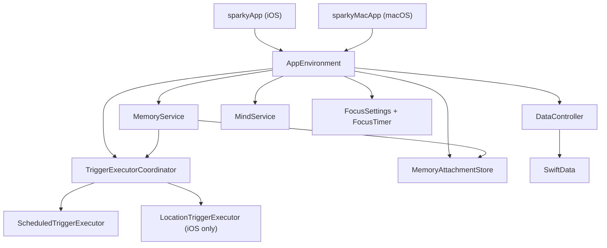

# Sparky

> A local-first memory and focus companion for iPhone and Mac.

Sparky is a native Apple app for capturing memories, notes, checklists, schedules, links, photos, audio, files, and place-based prompts. It turns those items into a private second brain organized by time, context, and hierarchical areas called Minds.

The iOS and macOS apps share the same SwiftUI domain, persistence, and service layers while using platform-specific navigation and presentation. Sparky does not require an account or custom backend. Each installation keeps its own local library, and data does not sync automatically between iPhone and Mac.

## Product Overview

Sparky is organized around four primary areas:

| Area | Purpose |
| --- | --- |
| Calendar | Browse scheduled Memories in Day and Month views, move through time, and create Memories from a specific day or time period. |
| Mind | Organize Memories into nested Minds with custom names, icons, colors, and All/Limbo views. |
| Focus | Run configurable Pomodoro sessions as Quick Focus or from a scheduled Memory with a dedicated Focus recipe. |
| Me | Review weekly completion activity, rhythm, streaks, and scheduled completion insights, then open Settings. |

### Core Capabilities

- Fast capture through Quick Memory on iPhone and a dedicated creation popover on Mac.
- Memory editing with a title, note, active/completed state, pinning, checklists, attachments, schedules, and completion history.
- One-time and recurring schedules with hourly, daily, weekly, monthly, yearly, weekday, interval, end-date, and occurrence-count options.
- Arrival and departure geofences on iPhone, with a maximum of 20 monitored location Memories.
- Photos, links, audio, and files stored locally outside SwiftData in the app's Application Support directory.
- Text search, content and trigger filters, pinned/active/completed sections, duplication, and bulk move/status/delete actions.
- Per-Memory and global Focus recipes with work, short-break, long-break, cycle, auto-continue, pause, reset, and extend controls.
- Local JSON backup and restore through `SparkyExportFormat` version `2.0`, with optional attachment and active-only export modes.
- System, light, and dark themes; iPhone also supports alternate app icons.
- Platform-aware onboarding for the permissions each app can actually use.

## Platform Capabilities

The mobile and desktop apps share the core product, but they do not expose identical OS integrations.

| Capability | iOS (iPhone-first) | macOS |
| --- | --- | --- |
| Primary navigation | Custom bottom navigation for Calendar, Mind, Focus, and Me | Centered floating navigation for Calendar, Mind, Focus, and Me |
| Calendar | Day and Month views with period-based quick capture | Day and Month views with a seven-date Day selector and popover capture |
| Memory editor | Quick sheet and full-screen editor | Native popover-based editor |
| Scheduled notifications | Supported | Supported |
| Location geofences | Create, edit, and execute arrival/departure triggers | Imported configuration is preserved and disclosed as iPhone-only; Mac does not arm geofences |
| Photos | Photo library and camera capture | Photo picker and file-based attachment |
| Audio | Record and play audio | Play existing audio; microphone recording is not exposed |
| Links and files | Supported | Supported |
| Focus | Quick and Memory-bound sessions while the app is active | Quick and Memory-bound sessions while the app is active |
| Alternate app icons | Supported | Not exposed |
| Settings | Navigation from Me | Native Settings window |
| Updates | Xcode, TestFlight, and App Store release path | GitHub Releases with Sparkle updates |
| Cross-device data | No automatic sync; transfer through JSON export/import | No automatic sync; transfer through JSON export/import |

## Install on Mac

The macOS app is distributed through GitHub Releases. Review [`scripts/install.sh`](scripts/install.sh), then install the latest release with:

```bash
curl -fsSL https://rckbrcls.com/api/sparky/install | bash
```

The installer selects the universal release archive, installs `Sparky.app` into `/Applications` or `~/Applications`, and clears the downloaded quarantine attribute. The app also embeds Sparkle and exposes **Check for Updates...** from the application menu.

Current release automation uses ad-hoc signing rather than Developer ID signing and notarization. Gatekeeper behavior should be verified for every release; a first launch may require opening the app from Finder's context menu.

See [GitHub Releases](https://github.com/rckbrcls/sparky/releases) and [`docs/deployment.md`](docs/deployment.md) for distribution details.

## Architecture

Sparky is a single Xcode project using MVVM + Services + Executors. `AppEnvironment` is the dependency container shared by both app entrypoints.


```mermaid
flowchart TD
    IOS["sparkyApp (iOS)"] --> Environment["AppEnvironment"]
    Mac["sparkyMacApp (macOS)"] --> Environment
    Environment --> Data["DataController"]
    Environment --> Memory["MemoryService"]
    Environment --> Mind["MindService"]
    Environment --> Triggers["TriggerExecutorCoordinator"]
    Environment --> Attachments["MemoryAttachmentStore"]
    Environment --> Focus["FocusSettings + FocusTimer"]
    Data --> SwiftData["SwiftData"]
    Memory --> Attachments
    Memory --> Triggers
    Triggers --> Scheduled["ScheduledTriggerExecutor"]
    Triggers --> Location["LocationTriggerExecutor (iOS only)"]
```

- `sparky/sparkyApp.swift` hosts the iOS tab shell in `ContentView`.
- `sparkyMac/sparkyMacApp.swift` hosts the macOS shell in `DesktopRootView` and owns Sparkle update integration.
- `sparky/AppEnvironment.swift` wires persistence, services, trigger execution, attachments, settings, Focus, bootstrap, and notification routing.
- `sparky/Data/DataController.swift` creates the local SwiftData `ModelContainer` and main `ModelContext`.
- `sparky/Services/MemoryService.swift` owns Memory CRUD, completion, filtering, attachments, and trigger synchronization.
- `sparky/Services/MindService.swift` owns hierarchical Minds and the current internal Tag infrastructure.
- `sparky/Executors/TriggerExecutorCoordinator.swift` always coordinates scheduled notifications and adds CoreLocation execution on iOS.
- `sparky/Managers/MemoryAttachmentStore.swift` is a file-system actor for photo, link, audio, and file payloads.
- `sparky/Focus/` contains the Focus recipe, settings, timer engine, notifications, and session UI.
- `sparky/ViewModels/MemoryEditorViewModel.swift` converts editor state into value-type drafts before persistence.

## Technology

| Area | Implementation |
| --- | --- |
| Platforms | Native iOS 26.0 and macOS 26.0 |
| UI | SwiftUI with platform-specific shells and presentation |
| Persistence | SwiftData, Application Support files, and UserDefaults |
| State and concurrency | `ObservableObject`, `@Published`, Combine, async/await, MainActor-by-default |
| Notifications | UserNotifications |
| Location | CoreLocation and MapKit on iOS |
| Attachments | FileManager, PhotosUI, AVFoundation, UniformTypeIdentifiers, Quick Look, and LinkPresentation |
| Focus | Local Pomodoro engine with schedule-bound recipes |
| Mac updates | Sparkle through Swift Package Manager |
| Testing | Swift Testing unit tests and XCTest UI test scaffolding |
| Release automation | GitHub Actions, GitHub Releases, GitHub Pages, appcast, and installer scripts |

The repository has no custom API server, authentication service, cloud-sync service, Docker setup, or multi-service runtime.

## Repository Structure

```text
.
├── sparky.xcodeproj/              # Xcode project and shared Mac scheme
├── sparky/                        # Shared domain, services, and UI plus the iOS entrypoint
│   ├── Data/                      # SwiftData stack
│   ├── Executors/                 # Scheduled and iOS location execution
│   ├── Focus/                     # Focus models and timer engine
│   ├── Managers/                  # Theme, app icon, and attachment storage
│   ├── Model/                     # SwiftData models, drafts, recurrence, and export contracts
│   ├── Services/                  # Memory, Mind, import/export, and bulk-action services
│   ├── ViewModels/                # Editor state and persistence bridge
│   └── Views/                     # Shared, iOS, and desktop SwiftUI surfaces
├── sparkyMac/                     # macOS entrypoint, Info.plist, and entitlements
├── sparkyTests/                   # Swift Testing unit tests
├── sparkyUITests/                 # XCTest UI test target
├── specs/                         # Implemented feature specifications and acceptance notes
├── docs/                          # Architecture, persistence, security, and release documentation
├── scripts/                       # macOS installer and appcast updater
├── screenshots/                   # Screenshot capture checklist; no product screenshots yet
├── .github/workflows/release.yml  # macOS release and GitHub Pages pipeline
├── appcast.xml                    # Sparkle update feed
└── AppStoreMetadata.md            # iOS App Store metadata and review notes
```

## Local Development

### Requirements

- macOS with Xcode 26.x and the iOS 26 and macOS 26 SDKs.
- An iOS simulator or device for the mobile target.
- The `My Mac` destination for the desktop target.
- Apple Developer signing only when running on a device, archiving, or distributing.

No project-specific environment variables are required.

Open the project from the repository root:

```bash
open sparky.xcodeproj
```

The project contains four targets:

| Target | Purpose | Bundle identifier |
| --- | --- | --- |
| `sparky` | iOS app | `polterware.sparky` |
| `sparkyMac` | macOS app, product name `Sparky.app` | `polterware.sparky.mac` |
| `sparkyTests` | Swift Testing unit tests | `polterware.sparkyTests` |
| `sparkyUITests` | XCTest UI tests | `polterware.sparkyUITests` |

Useful command-line equivalents:

```bash
# iOS
xcodebuild -scheme sparky -destination 'platform=iOS Simulator,name=iPhone 16' build
xcodebuild -scheme sparky -destination 'platform=iOS Simulator,name=iPhone 16' test

# macOS
xcodebuild -scheme sparkyMac -destination 'platform=macOS' build
```

Important project settings:

- `SWIFT_DEFAULT_ACTOR_ISOLATION = MainActor`
- `SWIFT_VERSION = 5.0`
- iOS deployment target `26.0`
- macOS deployment target `26.0`
- iOS background mode `location`
- SwiftData main-context autosave enabled

Unit tests cover Memory service behavior, recurrence completion, schedule/location persistence, calendar occurrence and layout calculations, quick capture targets, platform capabilities, Focus recipes and timer behavior, desktop navigation, and weekly Me metrics. The UI test target currently provides launch and performance scaffolding.

## Distribution

| Platform | Current path |
| --- | --- |
| iOS | Manual Xcode archive, App Store Connect, and TestFlight flow |
| macOS | `.github/workflows/release.yml` builds a universal app, signs it ad hoc, creates a GitHub Release, updates `appcast.xml`, and publishes the appcast and installer through GitHub Pages |

The Mac app checks the configured Sparkle feed and offers a manual update action. iOS release credentials, App Store Connect configuration, final screenshots, and TestFlight acceptance remain external to the repository.

## Data, Privacy, and Network Boundaries

- Memories, Minds, checklists, schedules, location configurations, attachment references, and completion dates are stored locally with SwiftData.
- Attachment payloads are stored under the app's Application Support directory.
- Settings, theme, onboarding state, and Focus defaults use UserDefaults.
- There is no iCloud, CloudKit, App Group, account, authentication, analytics, advertising, or tracking integration in this repository.
- iPhone and Mac stores are independent. JSON export/import is the current continuity mechanism.
- A full JSON export can contain notes, places, photos, audio, links, and files, so exported backups should be treated as sensitive.
- Local-first does not mean zero network access. MapKit, location search, reverse geocoding, link previews, Sparkle, GitHub Releases, and the installer may use Apple, destination, GitHub, or configured update services.

See [`docs/security.md`](docs/security.md) for the Privacy Manifest, permission model, and data-handling risks.

## Documentation

- [`docs/index.md`](docs/index.md): documentation map.
- [`docs/getting-started.md`](docs/getting-started.md): setup and local workflow.
- [`docs/architecture.md`](docs/architecture.md): architecture and data flow.
- [`docs/development.md`](docs/development.md): development conventions.
- [`docs/database.md`](docs/database.md): SwiftData, attachments, and backup format.
- [`docs/security.md`](docs/security.md): privacy, permissions, and local data.
- [`docs/deployment.md`](docs/deployment.md): iOS and macOS distribution.
- [`docs/troubleshooting.md`](docs/troubleshooting.md): common development and runtime issues.

## Validation Status

This README reflects static inspection of the app sources, Xcode project, tests, feature specifications, release workflow, scripts, and update feed. The documentation update itself does not claim fresh build, simulator, device, notification, geofence, accessibility, or release acceptance.

## License

No license file is currently included. Add a `LICENSE` before distributing the source publicly or accepting external contributions.
