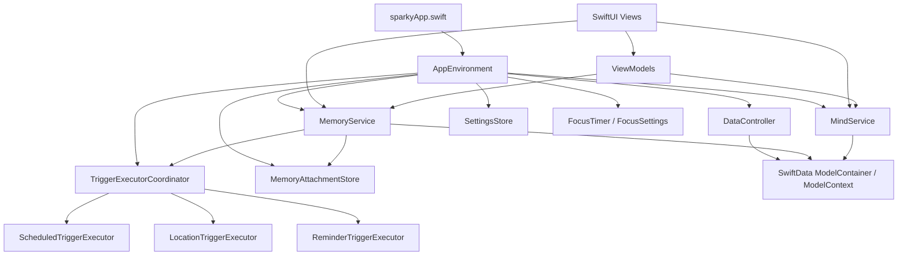

# Architecture

Sparky is a local-first SwiftUI iOS app organized around MVVM, service objects, SwiftData persistence, and trigger executors. The project is intentionally app-local: no custom backend, API server, authentication service, or cloud sync layer was identified in the current codebase.

## High-Level Shape

## Application Bootstrap

`sparky/sparkyApp.swift` creates the long-lived app environment:

- `AppEnvironment(dataController: DataController.shared)` is stored as a `@StateObject`.
- `ThemeManager.shared` is stored as a `@StateObject`.
- `ContentView` receives the environment directly and also through `.environmentObject(...)`.
- The SwiftData `ModelContainer` is injected through `.modelContainer(appEnvironment.dataController.container)`.
- `.task { appEnvironment.bootstrap() }` refreshes Minds, Tags, and Memories, then requests notification authorization after onboarding has completed.
- When the app becomes active, `sparkyApp` refreshes Minds, Tags, and Memories again.

`AppEnvironment` also installs a foreground notification delegate so notification taps can open the relevant Memory.

## Root Navigation

`sparky/ContentView.swift` owns the primary app shell:

- Calendar tab: `MemoryTimelineView`
- Mind tab: `MindRootView`
- Me tab: `MeView`
- Custom bottom tab bar with a central Memory creation button.
- Full-screen Memory editor presentation.
- Full-screen Mind composer presentation.
- Quick Memory sheet for fast capture.
- Full-screen onboarding flow when onboarding is incomplete.
- Pending notification-open handling that waits until the app is active, bootstrapped, and not blocked by another presentation.

## Domain Layers

### Models

The model layer lives under `sparky/Model/` and is split by domain:

- `Memory`: core persisted entity with status, checklist, attachments, trigger configs, completion history, and optional Mind relationship.
- `Mind`: hierarchical organization entity with virtual All and Limbo sentinels.
- `Tag`: color-coded classification entity.
- `CheckItemModel`: persisted checklist item.
- `ScheduleConfig`, `LocationConfig`: active primary trigger models. Nested reminder policy fields live on each primary; `ScheduleConfig.focusEnabled` gates Focus.
- `ReminderConfig`: legacy memory-level reminder retained only for SwiftData schema safety.
- `MemoryTriggerModel` and `MemoryTriggerLocation`: legacy trigger models retained in the SwiftData schema for migration safety.
- `SparkyExportFormat`: JSON backup/restore contract.
- `ICalExportFormat`: iCalendar converter for scheduled memories.

### Drafts

UI editing flows use value-type drafts before writing to SwiftData:

- `MemoryDraft`
- `CheckItemDraft`
- `ScheduleConfigDraft` (includes nested reminder + focusEnabled)
- `LocationConfigDraft` (includes nested reminder)

This keeps editor state separate from persisted objects until create/update actions are submitted through services.

### Services

Services are `@MainActor` objects and centralize mutations:

- `MemoryService` loads, indexes, filters, creates, updates, deletes, pins, completes, and syncs memories. It also coordinates attachment replacement and trigger synchronization after changes.
- `MindService` manages Minds and Tags, including default mind handling, hierarchical deletion, sorting, and cache refresh.
- `MemoryBulkActionProcessor` performs batch operations across selected memories.
- `DataExportService` creates JSON exports from current service state.
- `DataImportService` imports JSON exports and remaps IDs for imported Minds, Memories, and Attachments.

### Executors

Trigger executors translate persisted trigger config into OS behavior:

- `ScheduledTriggerExecutor` registers local notifications for one-time, recurring, weekday-mask, and interval schedules.
- `LocationTriggerExecutor` monitors CoreLocation circular regions and emits local notifications on entry or exit.
- `ReminderTriggerExecutor` schedules follow-up notifications from nested reminder policies on schedule and/or location configs.
- Focus sessions are started from schedule notifications (`Start Focus` action) via `FocusTimer` / `FocusSessionView` using global `FocusSettings`.
- `TriggerExecutorCoordinator` provides a single sync/unregister interface for the app.

The location executor enforces `LocationTriggerExecutor.maxGeofences = 20`, matching the practical iOS region-monitoring constraint in the implementation.

## Persistence Flow

`DataController` builds a SwiftData schema containing all persisted entities and exposes:

- `DataController.shared` for production data.
- `DataController.preview` for in-memory SwiftUI previews.
- `modelContext.autosaveEnabled = true` for the main context.
- A version-gated migration that copies legacy scheduled/location triggers into the newer 1:1 config models.

Memory attachments are not stored as SwiftData blobs. SwiftData stores attachment references, while `MemoryAttachmentStore` writes payloads to the app's Application Support directory under `MemoryAttachments`.

## Trigger Synchronization Flow

1. A view or view model submits a `MemoryDraft` to `MemoryService`.
2. `MemoryService` validates the draft, creates or updates SwiftData models, replaces attachment files, and saves the context.
3. `MemoryService.refresh(force: true)` reloads memories, repopulates transient attachments, rebuilds the memory index, and asks `TriggerExecutorCoordinator` to sync.
4. The coordinator syncs scheduled notifications, location geofences, and follow-up reminders from active memories.
5. If a location trigger fires, `LocationTriggerExecutor` notifies the user and calls back into `MemoryService.markPrimaryTriggerFired(...)` so reminders can start from the actual location event.

## External Framework Boundaries

Sparky does not define a custom external API, but it uses Apple/system frameworks:

- UserNotifications for local notifications.
- CoreLocation for geofence monitoring.
- MapKit and CLGeocoder/MKLocalSearch for location search and map interactions.
- LinkPresentation for link metadata previews.
- PhotosUI, AVFoundation, and camera APIs for attachment capture.

These are not backend integrations owned by the app, but some may use network-backed Apple or destination services when a user invokes those features.

## Current Architectural Limitations

- Trigger migration is still represented in the schema through legacy trigger models.
- There is no documented cloud backup or sync implementation.
- App Store release automation and CI/CD are not present in the repository.
- Final release validation depends on Xcode, signing configuration, App Store Connect, screenshots, and physical-device/TestFlight checks outside the current codebase.
